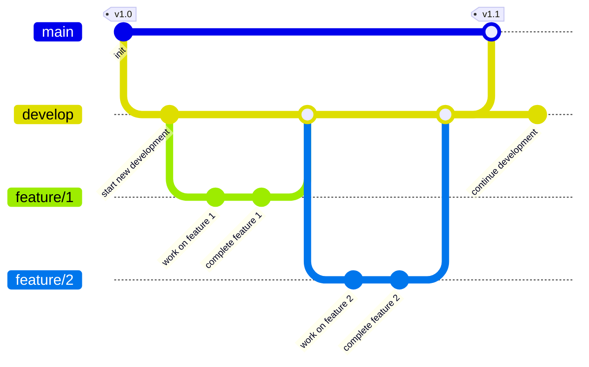

# Speedrun App

This is an educational project designed to demonstrate DevOps practices and principles in a practical context. The application provides a simple speedrun tracking API, serving as a foundation for learning about CI/CD pipelines, containerization, environment management, and other DevOps concepts.

While the application itself offers basic speedrun management functionality, its primary value lies in the implementation of DevOps practices, making it an ideal learning resource for understanding modern software deployment and operations.

## Table of Contents

- [Features](#features)
- [Installation](#installation)
- [Usage](#usage)
- [API Documentation](#api-documentation)
- [Testing](#testing)
- [CI/CD Pipeline](#cicd-pipeline)
- [Contributing](#contributing)
- [License](#license)

## Features

- **Game Management**: Add, update, and delete games.
- **User Management**: Manage users who participate in speedruns.
- **Category Management**: Define and manage categories for speedruns.
- **Speedrun Tracking**: Create, update, and delete speedruns.
- **API Security**: Secure API endpoints with an API key.

## Installation

To get started with the Speedrun App, follow these steps:

1. **Clone the repository**:

    ```bash
    git clone https://github.com/yourusername/speedrun-app.git
    cd speedrun-app
    ```

2. **Install dependencies**:

    ```bash
    yarn install
    ```

3. **Set up environment variables**: Create a `.env` file in the root directory and configure the following variables:
    ```plaintext
    MARIADB_USER=your_db_user
    MARIADB_PASSWORD=your_db_password
    MARIADB_DATABASE=your_db_name
    MARIADB_HOST=your_db_host
    EXPRESS_PORT=your_express_port
    APP_API_TOKEN=your_api_token
    ```
4. **Run the database**:

    ```bash
    yarn db:up
    ```

5. **Start the application in dev mode**:
    ```bash
    yarn start-dev
    ```

## Usage

The application provides a RESTful API to manage speedruns. You can interact with the API using tools like `curl`, `Bruno`, or any HTTP client library.

## API Documentation

The API documentation is available via Swagger UI. Once the application is running, you can access the documentation at `http://localhost:<EXPRESS_PORT>/docs`.

## Testing

The application includes a suite of tests to ensure functionality. To run the tests, use the following command:

```bash
yarn test
```

## CI/CD Pipeline

The application uses Jenkins for continuous integration and deployment, implementing a simplified Gitflow workflow. This pipeline demonstrates key DevOps practices and principles for managing software development lifecycle.

### Branch Strategy

- `main`: Production-ready code, only stable and tested code is merged here
- `develop`: Integration branch for features, used as the base for feature branches
- `feature/*`: Feature development branches, created from develop for new features or fixes

#### Branching Strategy Diagram



This diagram illustrates:

1. The main branch containing production-ready code. The production environment is created from this branch.
2. A develop branch where features are integrated. The test environment is created from this branch.
3. Feature branches (`feature/*`) created from develop
4. Features being merged back into develop
5. Stable releases being merged into main with a tag

The workflow shows how code flows from feature branches → develop → main, ensuring only stable and tested code reaches production.

### Environment Configuration

#### Ports

- Production (main branch):
    - API: 3001
    - Database: 3306
- Test (develop branch):
    - API: 3002
    - Database: 3307
- Feature branches:
    - API: 4500-4999 (dynamically assigned)
    - Database: 4000-4499 (dynamically assigned)

#### Environment IDs

- Production: `prod`
- Test: `test`
- Feature branches: `review-{branch-name}-{build-number}`

### Pipeline Stages

1. **Checkout**: Fetches the latest code
2. **Setup**: Prepares the development environment
3. **Lint**: Performs code quality checks
4. **Unit Tests**: Runs unit tests
5. **Deploy Review Environment**: Sets up review environment
6. **Integration Tests**: Runs API and database tests
7. **Build**: Creates Docker images (develop and main branches only)
8. **Deploy Test**: Deploys to test environment (develop branch)
9. **Deploy Production**: Deploys to production (main branch)

### Required Jenkins Credentials

- `app-api-token`: Security token for API authentication
- `mariadb-root-password`: Database root password
- `mariadb-password`: Database user password

### Database Configuration

- Database Name: `planitlh` (configurable)
- Database User: `lhuser` (configurable)
- Database Host: `host.docker.internal` (configurable)

### Continuous Integration

- Source code is polled every 5 minutes
- Build retention:
    - Main branch: 10 builds
    - Feature branches: 3 builds for 2 days

### DevOps Learning Points

#### 1. Continuous Integration (CI)

- Automated testing on every code change catches issues early
- Code quality checks (linting and formatting) ensure consistency
- Regular integration into the develop branch reduces integration challenges
- Containerized test environments provide consistency across different setups

#### 2. Continuous Deployment (CD)

- Automated deployments streamline the release process
- Feature branch deployments enable review and feedback before merging
- Production deployments only from main branch ensure stability
- Environment-specific configurations ensure correct setup

#### 3. Best Practices

- Environment separation (review/test/prod) prevents testing from affecting live systems
- Port isolation between environments prevents conflicts
- Automated cleanup of resources manages system resources efficiently
- Version tagging provides traceability of production code
- Secure credential management protects sensitive information
- Parameterized builds offer deployment flexibility
- Consistent test environments using containers ensure reliable testing

### Security Management

- Sensitive data (passwords, tokens) stored as Jenkins credentials
- Non-sensitive data configurable via pipeline parameters
- Credentials automatically masked in logs
- Parameters modifiable per build for different requirements
- Environment-specific value overrides ensure correct configuration

### Configuration Management and 12-Factor Methodology

This application follows the [12-factor app methodology](https://12factor.net/), particularly regarding configuration management, which greatly simplifies our DevOps pipeline implementation:

#### 1. Config as Environment Variables

- All configuration is stored in environment variables, following factor III (Config)
- No configuration is hardcoded in the codebase
- The pipeline can easily inject different configurations for different environments
- `.env` files are only used for local development, never in production

#### 2. Dev/Prod Parity

- Following factor X (Dev/Prod Parity), all environments are as similar as possible
- The same Docker containers run in all environments
- Only configuration values change between environments
- This ensures that if it works in test, it will work in production

#### 3. Port Binding

- Following factor VII (Port Binding), the app is completely self-contained
- No external web servers needed - the app exports HTTP as a service
- Ports are configurable via environment variables
- This allows the pipeline to dynamically assign ports without app changes

#### 4. Disposability

- Following factor IX (Disposability), the app can be started or stopped at any time
- The pipeline takes advantage of this for zero-downtime deployments
- Review environments can be created and destroyed quickly
- Containerization makes this even easier to manage

#### 5. Backing Services

- Following factor IV (Backing Services), the database is treated as an attached resource
- Database connection details are passed via environment variables
- The pipeline can easily configure different database instances for different environments
- This enables isolated database instances for feature branches

#### Benefits for DevOps

- **Easy Environment Management**: Configuration is external to the code
- **Consistent Deployments**: Same process works everywhere
- **Scalability**: New environments can be created without code changes
- **Security**: Sensitive configuration is never in the codebase
- **Automation**: Pipeline can fully control app behavior through environment variables
- **Isolation**: Each deployment can have its own resources
- **Reliability**: Consistent environment setup reduces "works on my machine" issues

### Port Management

The pipeline implements dynamic port assignment to prevent conflicts:

- Production uses fixed ports for stability
- Test environment uses dedicated ports
- Feature branches get automatically assigned ports from a predefined range
- Port overrides available through pipeline parameters when needed

## Real-World Considerations

This project serves as an educational example of DevOps practices. In real-world scenarios, you'll encounter additional complexity:

### Environment Complexity

- **Multiple Environments**: Production, staging, QA, development, and various testing environments
- **Region-Specific Deployments**: Multiple production environments across different geographical regions
- **Customer-Specific Instances**: Dedicated environments for enterprise customers
- **Compliance Environments**: Separate environments for regulatory requirements

### Infrastructure Considerations

- **Cloud Infrastructure**: While this example uses Docker Compose on a single host, real-world deployments typically involve:
    - Multiple cloud providers (AWS, Azure, GCP)
    - Kubernetes clusters for container orchestration
    - Load balancers and auto-scaling groups
    - Content Delivery Networks (CDN)
    - Database clusters and caching layers

### Additional Complexities

- **Monitoring and Observability**:
    - Application Performance Monitoring (APM)
    - Distributed tracing
    - Log aggregation
    - Real-time alerting
- **Security Measures**:
    - Web Application Firewalls (WAF)
    - DDoS protection
    - Security scanning and compliance checks
- **Backup and Disaster Recovery**:
    - Multi-region failover
    - Data backup strategies
    - Recovery point objectives (RPO)
    - Recovery time objectives (RTO)

### Cost Management

- **Resource Optimization**:
    - Auto-scaling policies
    - Development environment scheduling
    - Resource cleanup automation
- **Cost Monitoring**:
    - Budget alerts
    - Usage tracking
    - Cost allocation tags

## 12-Factor Principles in the Speedrun App

The Speedrun App demonstrates several key principles from the 12-factor methodology, making it a practical example for learning modern application development practices:

1. **Codebase**: One codebase tracked in Git, supporting deployment to multiple environments (dev, test, prod).

2. **Dependencies**: All dependencies are explicitly declared in `package.json` and installed via yarn, ensuring consistent builds.

3. **Config**: All configuration is stored in environment variables (see `.env` and `docker-compose.yml`), with no hardcoded values in the codebase.

4. **Backing Services**: The MariaDB database is treated as an attached resource, accessed via environment variables, making it easily swappable.

5. **Build, Release, Run**: Clear separation between build (yarn install, tsoa), release (Docker image), and run (container execution) stages.

6. **Processes**: The application runs as stateless processes, with data persistence handled by the MariaDB database.

7. **Port Binding**: The app exports HTTP as a service via port binding, configured through environment variables.

8. **Concurrency**: The application can scale horizontally through process execution, with each instance being self-contained.

9. **Disposability**: Fast startup and graceful shutdown implemented through Docker and proper signal handling (SIGTERM/SIGINT).

10. **Dev/Prod Parity**: Docker ensures consistent environments across development, testing, and production.

Areas for Student Exploration:

11. **Logs**: Currently implements basic console logging. Students can enhance this by implementing structured logging and log aggregation.

12. **Admin Processes**: While the application includes database operations, it could be enhanced with dedicated admin tools for one-off tasks.

These principles demonstrate modern application architecture while providing opportunities for further learning and improvement.
